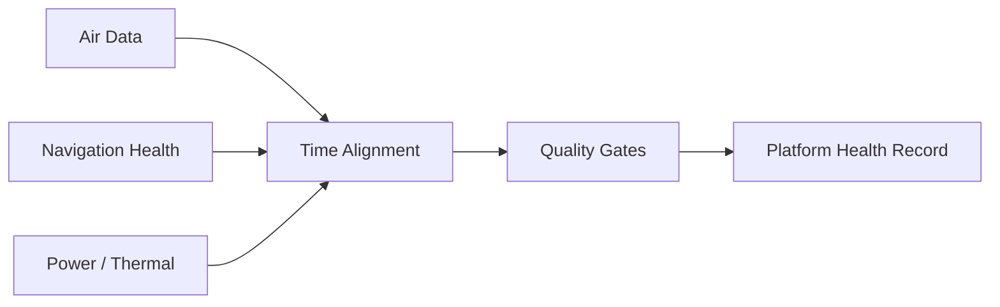

# Tactical Telemetry Fusion Engine

Defensive aerospace telemetry-integration demo that merges asynchronous synthetic health/status streams from a fictional airborne test platform. The public implementation focuses on time alignment, data quality, and system health—not targeting or operational combat logic.

## Features

- Multiple telemetry sources with independent sample rates
- Timestamp normalization and nearest-sample alignment
- Quality flags for stale or missing channels
- Derived platform-health score
- JSONL/CSV outputs, tests, and CI



## Run

```bash
python telemetry_fusion.py --duration 20 --output artifacts
python -m unittest discover -s tests -v
```

All telemetry is generated locally from fictional values.